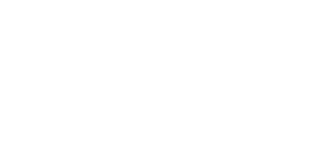

<!-- PROJECT LOGO -->
<br />


<h6 align="center">Isla Just 200080 and Jeandrè De Villiers 190025 IDV 303</h6>
<p align="center">
</br>
   
   <p align="center">
  <a href="https://github.com/isla-just/CuriousCreative2 ">
    
  </a>
  </p>
  
  <h3 align="center">The Curious Creative</h3>

  <p align="center">
    The Curious Creative is an employee-friendly management platform for a storybook illustration company.<br>
      <a href="https://github.com/isla-just/CuriousCreative2"><strong>Explore the docs »</strong></a>
      <br />
      <br />
      <a href="ReadMeImg/IslaJust_200080_DV300_T1_demo.mp4">View Demo</a>
       ·
       <a href="https://github.com/isla-just/CuriousCreative2/issues">Report Bug</a>
       ·
       <a href="https://github.com/isla-just/CuriousCreative2/issues">Request Feature</a>
   </p>

<!-- TABLE OF CONTENTS -->
## Table of Contents

* [About the Project](#about-the-project)
  * [Project Description](#project-description)
  * [Built with](#built-with)
* [Getting Started](#getting-started)
  * [Prerequisites](#prerequisites)
  * [Installation](#installation)
* [Features and Functionality](#features-and-functionality)
   * [Features](#features)
   * [Functionality](#functionality)
* [Concept Process](#concept-process)
   * [Wireframes](#wireframes)
   * [User-flow](#user-flow)
* [Development Process](#development-process)
   * [Implementation Process](#implementation-process)
        * [Highlights](#highlights)
        * [Challenges](#challenges)
   * [Reviews and Testing](#reviews-and-testing)
        * [Unit Testing](#unit-testing)
   * [Future Implementation](#future-implementation)
* [Final Outcome](#final-outcome)
   * [Mockups](#mockups)
   * [Video Demonstration](#video-demonstration)
   * [Promotional Video](#promotional-video)
* [Roadmap](#roadmap)
* [Contributing](#contributing)
* [License](#license)
* [Contact](#contact)
* [Acknowledgements](#acknowledgements)

<!--PROJECT DESCRIPTION-->
## About the Project

![image1][image1]

### Project Description
for this brief we were tasked with creating a desktop application for management of a creative studio. We decided to take this brief and give it a creative twist...

We had to use the very new platform .NET Maui in conjunction with SQLite for our data storage

The Curious Creative is an employee-friendly management platform for a storybook illustration company. Doing the boring task of managing creatives, projects, clients and funds in a colourful and fun environment

### Built With

* [.NET Maui](https://docs.microsoft.com/en-us/dotnet/maui/what-is-maui)
* [Visual Studio](https://visualstudio.microsoft.com/)
* [SQLite](https://www.sqlite.org/index.html)


<!-- GETTING STARTED -->
## Getting Started

These instructions will get you a copy of the project up and running on your local machine for development and testing purposes.

### Prerequisites

For development, the latest version (ideally the 2022 preview) of Visual Studio is required - install it with .NET 6.0. The latest version can be downloaded from [here](https://visualstudio.microsoft.com/). During the installation of Visual Studio ensure you select ASP.Net and web development, .NET Multi-platform App UI development and .NET desktop development

### Installation
 
1. Clone the repo
```sh
git clone https://github.com/isla-just/CuriousCreative2.git
```
2. Locate the solution and open it in Visual Studio

3. Install the following Nuget packages if Nuget package manager doesn't do that automatically
- CommunityToolkit.Mvvm
- Microsoft.Maui.Dependencies
- Microsoft.Maui.Extensions
- Microsoft.Toolkit.Mvvm
- sqlite-net-sqlcipher
- SQLitePCLRaw.core
- SQLitePCLRaw.provider.dynamic_cdec1
- SQLitePCLRaw.provider.sqlite3
- Syncfusion.Maui.Charts

4. Locate the 'Migrations' folder in 'resources'. The file can be located using this file path:
TheCuriousCreative2/TheCuriousCreative2/Resources/Migrations/Staff.db3

5. Copy the 'Staff.db3' file to your local machine inside your Documents folder

6. Build and run the application by pressing the play button and

7. Login with user 'Sally Williams' and password '123456'

8. Once authenticated, you will be taken to the dashboard page. Please note that the sqlite database stored on your machine will populate with data as you add information on the app

<!-- FEATURES AND FUNCTIONALITY-->
## Features and Functionality

### Features

### Login and authentication

![image2][image2]

The login screen enables admin users to log into the curious creative and remain logged in. With password encryption, this should be a breeze. The user can also choose to stay logged in and this is stored in preferences

### Dashboard screen

![image3][image3]

The dashboard screen provides an overview of all client, project, funds, teams and employee data. You can see featured projects and visualisations of funds done using Syncfusion charts

### Client management

![image4][image4]

Search and filter through a list of employees. Add a new employee, edit existing employees or even delete employees. Dynamically updating profile picture selection where your picture resembles the client archetype

### Creatives
![image5][image5]

Search and filter through a list of creatives/ staff members. Search and filter through all of our creatives. Add a new creative, edit existing creatives or even delete a creative. Dynamically upload a fun profile picture and assign projects, hours, teams and salaries

### Projects

![image6][image6]

Search and filter through a list of projects hosted on our app. Search and filter through all of the available projects. Add a new project, edit an existing project or even delete a project. Dynamically upload a project banner and assign teams, hours and clients

### Funds

![image7][image7]

Get an overview and breakdown of the current month's funds as well as view history with curved graphs with tooltips to see the amount history. Send projects for printing and close off the month


### Functionality

* `Authentication` using password encryption
* `Preferences` to save login data
* `dynamic visualisations` to view details about funds
* `data summaries` and counters to give you an overview of data
* `Add, edit and delete` CRUD functionality on clients, projects and employee pages
* `search and silter data` on clients, projects and employee pages
* `view design teams` on dashboard, projects and employee pages
* `close off month` to zero funding at the end of the month and
* `count down month` to know when you have to close off the month
* view individual funds history with `SF charts` 
* dynamically calculated `funds and categories` 
* send projects for `printing functionality` 


<!-- CONCEPT PROCESS -->
## Concept Process

The `Conceptual Process` is the set of actions, activities and research that was done when starting this project.

### Initial designs

![image8][image8]

### User-flow

![image9][image9]

### ERD

![image10][image10]

<!-- DEVELOPMENT PROCESS -->
## Development Process


The `Development Process` is the technical implementations and functionality done in the backend of the application.

### Implementation Process

#### Navigation
We started off by setting up our dev environment and our Github and begun setting up our flyout navigation that is needed on all the screens. We also played around making sure that the styling was nice.

#### Frontend development
After finalising our designs in Figma, we started developing our frontends. We started with the general layout using grids and then started populating each page with data

#### CRUD application
A huge hurdle to cross in this project was the CRUD functionality. We implemented add, edit and delete functionality on all the respective pages. Here we also focussed on toggling forms and UX

#### Calculations and filtering
Then we focussed on actually using our data meaningfully. We added search and filtering functionality. And added  calculations on the funds and dashboard pages - to show summaries of data

#### Login and authentication
Next, I focussed on the login and authentication functionality and crud. I also made sure to encrypt the password in the database. I also included stay logged in functionality using preferences

#### Charts and refinements
We started adding finishing touches to our frontends. After struggling very long with charts compatibility on mac, I ended up using the Syncfusion charts for all of our data visualisations

### Highlights
## Jeandre's highlights

* I was thrilled to be designing and creating a project that suited both my teammate and my interests and design styles.

## Isla's highlights

* I enjoyed working so collaboratively in a team and being able to do something so creative and fun that I think showcases both Jeandrè and my personalities

#### Challenges
## Jeandre's challenges

* Working with a developing tool that is so new posed challenges when trying to implement some styling elements and routing within our app.

## Isla's challenges

* Working with .NET Maui was definitely not as simple as we thought it would be due to it being so new - for example the charts. It also made frontend a little tricky with assigning active states and popups


#### Future Implementation

* Further UX refinement with forms and validation
* Custom popups for feedback
* Printing functionality refinements
* Print PDF of monthy balance sheet
* Wifi connectivity for online capabilities
* More admin authentication when performing CRUD

<!-- MOCKUPS -->
## Final Outcome

### Mockups

![image11][image11]

<!-- VIDEO DEMONSTRATION -->
## Video Demonstration

To see a run through of the application, click below:

[View Demonstration]()

<!-- PROMO VIDEO -->
## Promotional Video

To see the promotional video, click below:

[View Promotional Video]()

<!-- ROADMAP -->
## Roadmap

See the [open issues](https://github.com/isla-just/CuriousCreative2/issues) for a list of proposed features (and known issues).

<!-- CONTRIBUTING -->
## Contributing

Contributions are what make the open source community such an amazing place to be learn, inspire, and create. Any contributions you make are **greatly appreciated**.

1. Fork the Project
2. Create your Feature Branch (`git checkout -b feature/AmazingFeature`)
3. Commit your Changes (`git commit -m 'Add some AmazingFeature'`)
4. Push to the Branch (`git push origin feature/AmazingFeature`)
5. Open a Pull Request

<!-- AUTHORS -->
## Authors

* **Isla Just** - [IslaJust](https://github.com/isla-just)
* **Jeandrè De Villiers** - [Jeandrè De Villiers](https://github.com/Jeandre-jpg)

<!-- LICENSE -->
## License

Distributed under the MIT License. See `LICENSE` for more information.\

<!-- LICENSE -->
## Contact

* **Isla Just** - [@byislajust](https://www.instagram.com/byislajust/) - isla@just.co.za
* **Jeandrè De Villiers** - 190025@virtualwindow.co.za
* **Project Link** - https://github.com/isla-just/CuriousCreative2

<!-- ACKNOWLEDGEMENTS -->
## Acknowledgements

### Ilutrations and animations:
https://dribbble.com/rafaelvarona
https://dribbble.com/karolin_gu
https://dribbble.com/alexprc
https://dribbble.com/itsAnnaHurley
https://www.pexels.com/video/woman-using-her-ipad-4962638/
Musuc by AudioCoffee on Pixabay

### mockups
https://www.anthonyboyd.graphics/
https://www.freepik.com/

### tutorials and documentation
https://docs.microsoft.com/en-us/dotnet/maui/
https://help.syncfusion.com/maui/cartesian-charts/getting-started
https://docs.microsoft.com/en-us/learn/paths/build-apps-with-dotnet-maui/
https://github.com/praeclarum/sqlite-net
https://www.youtube.com/c/ProgrammingWithPragnesh

* lecturer: Armand Pretorius https://github.com/ArmandPret

[linkedin-shield]: https://img.shields.io/badge/-LinkedIn-black.svg?style=flat-square&logo=linkedin&colorB=555
[linkedin-url]: https://www.linkedin.com/in/isla-just-b038a2202
[instagram-shield]: https://img.shields.io/badge/-Instagram-black.svg?style=flat-square&logo=instagram&colorB=555
[instagram-url]: https://www.instagram.com/dylandasilva.designs/

<!-- MARKDOWN LINKS & IMAGES -->
[image1]: ReadMeImg/slide1.png
[image2]: ReadMeImg/slide2.png
[image3]: ReadMeImg/slide3.png
[image4]: ReadMeImg/slide4.png
[image5]: ReadMeImg/slide5.png
[image6]: ReadMeImg/slide6.png
[image7]: ReadMeImg/slide7.png
[image8]: ReadMeImg/slide8.png
[image9]: ReadMeImg/slide9.png
[image10]: ReadMeImg/slide10.png
[image11]: ReadMeImg/slide11.png
[image12]: ReadMeImg/slide12.png

[image15]: ReadMeImg/devmockup1.png

 
